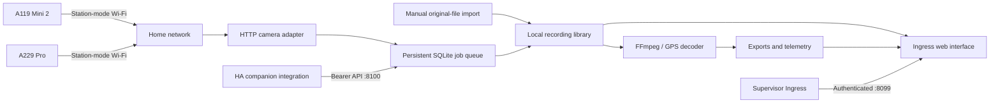

# Architecture and implementation scope

## Problem and operating model

The mobile apps connect directly to a camera, while Windows Player processes recordings already available to the computer. A Home Assistant implementation needs both roles: a network acquisition service and a media workstation. Cameras are intermittent sources, not continuously available security cameras. A server cannot assume that Wi-Fi stays enabled after ignition or in parking mode.

Each physical dashcam has its own profile and request lock. A119 Mini 2 is single-channel; A229 Pro can expose front/rear/interior recordings depending on attached hardware. Channel letters and recording timestamps group files, but timestamps alone do not establish frame-accurate synchronization.

## Components and source paths

| Path | Responsibility |
|---|---|
| `viofo_workbench/config.yaml` | Supervisor options, architecture, Ingress and storage mapping |
| `viofo_workbench/Dockerfile` | Python runtime, FFmpeg/ffprobe, DejaVu fonts |
| `viofo_workbench/app/core.py` | SQLite, profiles, quotas, rotating logs, atomic JSON writes |
| `viofo_workbench/app/camera.py` | Novatek settings, listings, bounded HTTP, serialized transfers |
| `viofo_workbench/app/media.py` | GPS atom traversal, frame extraction, FFmpeg rendering |
| `viofo_workbench/app/server.py` | HTTP API, Ingress checks, jobs, scheduler, retention, diagnostics |
| `viofo_workbench/app/static/` | Responsive UI and vendored Leaflet |
| `custom_components/viofo_workbench/` | Config flow, coordinator, entities and HA diagnostics |
| `scripts/extract_command_metadata.py` | Reproducible extraction of factual command metadata from an APK |

## Persistence

- `/data/workbench.sqlite`: library index and job state, WAL journaling.
- `/data/cameras.json`: two camera profiles. No Wi-Fi password is required; station mode is configured on the camera.
- `/data/preferences.json`: in-app quota, retention, sync and log preferences. These override the same initial Supervisor defaults at startup; storage path and token remain Supervisor-owned.
- `/data/logs/debug.log`: 2 MB rotating file, four backups (approximately 10 MB maximum).
- `/media/viofo/recordings`: originals stored under generated names, preserving the original filename in SQLite.
- `/media/viofo/exports`: generated MP4/JPEG outputs and temporary processing directories.

Back up `/data` and footage together. Restoring only the index leaves missing recording paths. Moving `storage_path` does not migrate indexed files automatically; do not change it after importing until an explicit migration is implemented. Existing exports count toward quota and need manual cleanup; automated export retention is not implemented.

## Camera API boundaries

Known read paths: firmware `3012`, status/settings `3014`, file listing `3015`. Disk/card read identifiers are recorded but not currently surfaced. HTTP directory fallback reads `/DCIM/Movie`, `/DCIM/Movie/RO` and `/DCIM/Movie/Parking`.

Reads have timeouts, bounded response size and no redirects. Camera addresses must be literal RFC1918 IPv4 addresses. Download URLs derive only from validated `/DCIM/` file paths; traversal and query injection are rejected.

Setting writes require the camera profile's explicit control switch, an enumerated option in the matching model table, and a command present in the camera's current-status response. Duplicate indexes with different labels are ambiguous and read-only. The metadata contains firmware-version conditions; applying version-threshold semantics automatically is deferred until validated. Recording start/stop is a dedicated 0/1 control. Every write requires a response and subsequent status confirmation. Writes are never automatically retried after uncertain success; recording is never stopped implicitly to apply settings.

Device mutations such as format/reset/firmware/delete are blocked at transport level. This is an implementation boundary, not a claim that VIOFO lacks those functions.

## Downloads and recovery

The single processing worker persists state, serializes media work and permits queue priority changes. Per-camera locks serialize camera reads/writes/downloads across both API listeners. Automatic syncing defers the newest file per channel. Manual transfers compare repeated HEAD sizes, received length, post-download size, and media parseability, then atomically register the completed file. Camera firmware may report stale sizes even for active recordings; these checks are necessary but do not prove end-of-recording on every firmware. A local SHA-256 identifies the stored copy; it is not a remote-camera checksum comparison.

Pause/cancel kills media work and cleans transient output; resuming restarts a file/job from the beginning. Jobs interrupted by application restart return to queued. Failed jobs remain visible and support explicit retry; a future sync can enqueue a new attempt. There is no implicit unbounded retry loop. The local library is never presented as containing a complete camera backup merely because some jobs succeeded.

## Browser media

Original files use HTTP byte ranges. Browser codec support varies, especially HEVC. A compatibility export uses H.264/AAC. Live view transcodes the documented root RTSP stream to low-rate MJPEG (5 fps, 960-pixel width, no audio). It is capped at two clients; this implementation is for inspection, not continuous multi-camera NVR recording. Per-lens RTSP routing and audio remain unverified.

GPS positions derive from Novatek GPS atoms. Timestamp alignment is relative to the first valid fix and explicitly labeled, not assumed to match video time exactly. The parser bounds atom sizes, offsets and sample count and handles extended-size MP4 atoms. There is no fabricated G-sensor data: CSV import and graphs work, but embedded decoding/calibration awaits actual samples.

## Interface contract

UI uses relative `api/` and `static/` URLs, so Supervisor's Ingress prefix is preserved. The UI port trusts only the direct Supervisor source IP `172.30.32.2`; forwarded headers cannot bypass the check. The optional integration port requires a nonempty bearer token. Mutating browser calls require a custom same-origin request header. CORS is not enabled.

Representative API routes:

- `GET api/status`, `GET api/library`, `POST api/import?camera=mini2`
- `PUT api/cameras/{id}`; `POST api/cameras/{id}/inspect|files|sync|download|settings`
- `GET api/clips/{id}/media|download|gps|gpx|telemetry`
- `POST api/clips/{id}/snapshot|proxy|protect|delete|telemetry`
- `POST api/exports`, `POST api/jobs/{id}`, `GET api/exports/{job_id}`
- `GET api/live/{camera_id}`, `GET api/diagnostics`, `PUT api/preferences`

The integration listener exposes only status and camera actions, not files or diagnostics. Future schema changes should bump the app version and provide a database migration before deployment.
